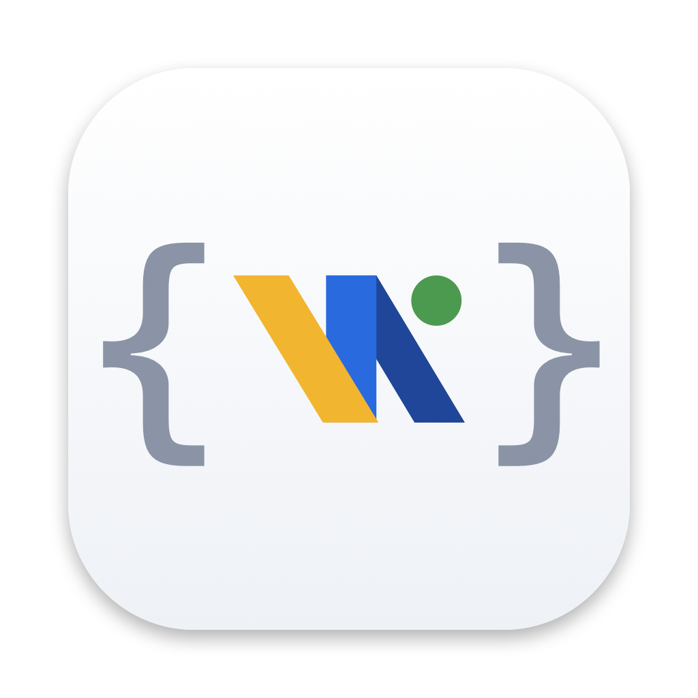
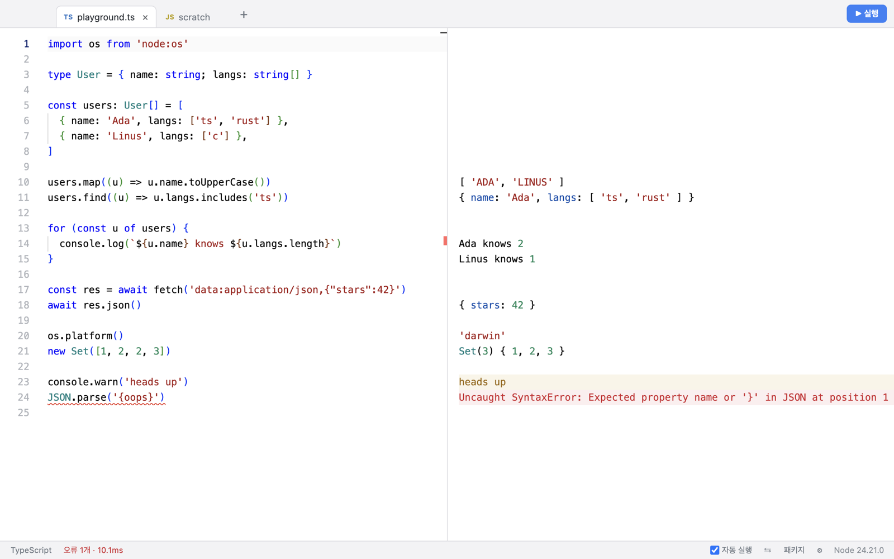

<p align="center">
  
</p>

<h1 align="center">RunTS</h1>

<p align="center">
  A JavaScript and TypeScript playground for macOS.<br />
  Type code and see every result right next to the line that produced it.
</p>

<p align="center">
  <a href="https://github.com/wonkooklee/runts/releases/latest"></a>
  
  <a href="LICENSE"></a>
</p>

<picture>
  <source media="(prefers-color-scheme: dark)" srcset="docs/screenshot-dark.png" />
  
</picture>

RunTS is inspired by [RunJS](https://runjs.app). It is built with Electron and the Monaco editor, and your code runs on the Node.js runtime bundled with the app (Node 24 in Electron 44), so Node APIs such as `fs` and `fetch` and packages from npm work as they do in a script.

> [!NOTE]
> The user interface is currently in Korean.

## Features

- **Live evaluation.** Code runs 300 ms after you stop typing. The delay is configurable, and with auto-run off you run code with ⌘R or ⌘↩.
- **Inline results.** The value of every top-level expression and every `console.*` call is shown beside its source line. Repeated output from the same line, such as `console.log` in a loop, stacks below it.
- **Errors where they happen.** Runtime errors are highlighted in the output pane and underlined in the editor. TypeScript errors are mapped back to the original line through source maps.
- **Modern syntax.** Top-level `await`, `import` and `require`, and Promise results are resolved before they are displayed.
- **TypeScript editor.** Monaco provides completion and type checking with Node.js type definitions included.
- **npm packages.** Install packages from inside the app and import them right away. Type definitions shipped with a package, or its `@types` package, feed editor completion.
- **Tabs and files.** Each tab has its own language and is restored on the next launch. Open and save `.js`/`.ts` files, or drop them onto the window or the Dock icon. Tabs backed by a file run with that file's folder as the working directory.
- **Settings.** Light and dark themes, side-by-side or stacked panes, font size, object inspection depth, and environment variables for `process.env`.

## Installation

Download the latest `.dmg` from [Releases](https://github.com/wonkooklee/runts/releases/latest), choosing `arm64` for Apple Silicon or `x64` for Intel Macs, then open it and drag **RunTS** into **Applications**.

The app is ad-hoc signed but not notarized, so macOS blocks it on first launch. After copying it to Applications, clear the quarantine flag once:

```bash
xattr -dr com.apple.quarantine /Applications/RunTS.app
```

### Build from source

Requires Node.js 22 and Yarn 4.

```bash
git clone https://github.com/wonkooklee/runts.git
cd runts
yarn
yarn package      # release/mac-arm64/RunTS.app and release/mac/RunTS.app (x64)
yarn dist         # release/RunTS-<version>-arm64.dmg and RunTS-<version>-x64.dmg
```

A locally built app is not quarantined and opens without the step above.

## Keyboard shortcuts

| Action | Shortcut |
|---|---|
| Run / Stop | ⌘R or ⌘↩ / ⌘. |
| Toggle auto-run | ⇧⌘R |
| New tab / New JavaScript tab / New TypeScript tab | ⌘T / ⇧⌘J / ⇧⌘T |
| Close tab / Switch tabs | ⌘W / ⌃Tab, ⌘1–9 |
| Toggle JavaScript ↔ TypeScript | ⇧⌘L |
| Open / Save / Save As | ⌘O / ⌘S / ⇧⌘S |
| npm packages / Settings | ⇧⌘P / ⌘, |
| Clear output | ⌘K |
| Toggle layout / Font size | ⌘\ / ⌘=, ⌘-, ⌘0 |

Double-click a tab to rename it, and drag tabs to reorder them.

## npm packages

Packages are installed into `~/Library/Application Support/RunTS/packages`. RunTS runs `npm install` through your login shell (`zsh -l`), so npm must be on that shell's `PATH`, whether it comes from nvm, Volta, or Homebrew. When resolving a module, RunTS looks in that folder first and then in the tab's working directory (your home folder for unsaved tabs).

## How it works

1. **Instrument.** The main process compiles the code to CommonJS with the TypeScript compiler's `transpileModule`. A custom transformer wraps each top-level expression as `__runts_result(line, expression)` and each `console.*` call as `__runts_console(line, ...)`, so every value carries its source line. JavaScript tabs go through the same path.
2. **Execute.** The compiled code runs inside an async function in a fresh Electron `utilityProcess`. Starting a new run kills the previous process, so an infinite loop never blocks the next edit, and a spare process is kept warm to cut startup time. Console output is produced by a Node `Console` writing into string buffers, so methods such as `console.table` and `console.time` format exactly as they do in a terminal. Calls that bypass instrumentation, like `const log = console.log`, and runtime errors find their line through the stack trace and source map.
3. **Align.** The renderer groups output by source line, pads it with blank lines so each result sits beside its code, and scrolls both panes together.

## Development

```bash
yarn dev     # build the renderer and start Electron
yarn test    # transformer, worker, and output layout tests
```

The renderer (`src/renderer`) is bundled by esbuild into `dist/renderer`, while the main process (`src/main`) runs unbundled. The app icon is drawn from code: run `swift build/icon.swift build/icon.png`, then use `iconutil` to regenerate `build/icon.icns`.

## Limitations

- Only top-level expressions show their values. Use `console.log` inside functions and blocks.
- Multi-line results, or several outputs from one line, push later results down and out of alignment with the source. Word wrap can also break alignment.
- Code runs in Node.js, so browser DOM APIs are not available.
- Output from a single run is capped at 5,000 entries.

## License

[MIT](LICENSE) © Wonkook Lee
